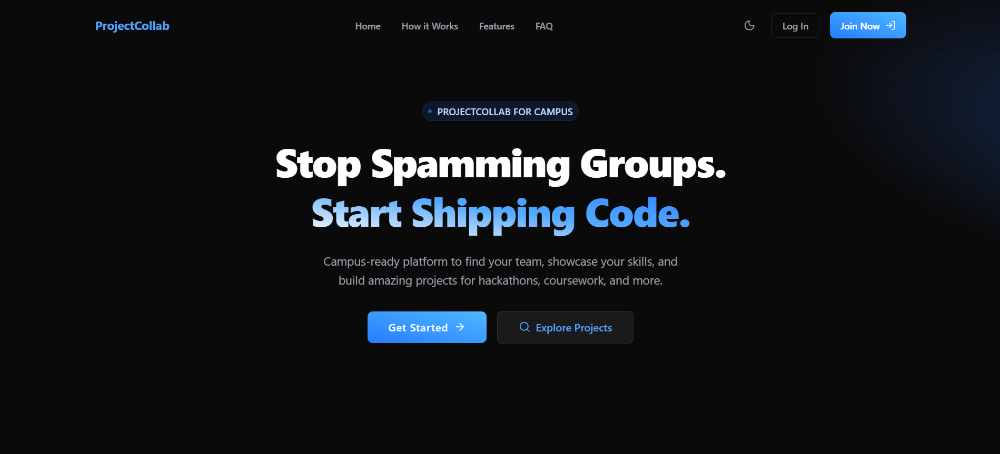

# ProjectCollab for Campus

A modern platform for campus developers and students to find project teammates, assemble teams, and build stronger portfolios — without spamming group chats.

---



---

## Overview
ProjectCollab helps students:
- Build detailed campus developer profiles (skills, year, GitHub, WhatsApp)
- Post projects or join teams based on skills and interests
- Quickly connect with teammates via WhatsApp instantly after acceptance

## 🎬 Demo Video
**Watch the full demo video:** [ProjectCollab Demo Video](client/public/ProjectCollab-Video.mp4)

---

## Live Website
**[https://projectcollab-web.vercel.app](https://projectcollab-web.vercel.app)**

---

## Features

### User & Team
- **Account System:** Register/login with required college-style email, password (JWT-based authentication)
- **Profile:** Add skills, year, GitHub URL, WhatsApp (for instant communication)
- **Team Formation:** Post projects, invite or apply, accept requests
- **In-app Notifications:** Real-time feedback via toast messages (react-hot-toast)

### Project Management
- **Project Board:** Browse, filter, or search postings by skill, type, or team size
- **One-click Apply:** Instantly apply or invite, manage memberships easily
- **Dashboard:** View, accept, or decline applications for your project
- **Team Communication:** WhatsApp sharing for direct contact (no WhatsApp API integration, just quick numbers)

### Modern UI/UX
- **Fully Responsive:** Works great on mobile & desktop
- **Dark/Light Mode:** Toggle for accessibility and user preference (Zustand-powered theme store)
- **Optimized Components:** Accessible, fast, visually attractive (Tailwind CSS)
- **Call-to-Action (CTA) & Hero Sections:** Encourage onboarding and project creation

### Security & Stack
- **JWT Auth:** Secure backend Express APIs
- **Password Hashing:** bcryptjs
- **MongoDB (Mongoose):** All data storage
- **Type safety:** TypeScript both ends
- **Best Practices:** Linting, modular codebase, .env usage

## Tech Stack
- **Frontend:** React 18 (Vite + TailwindCSS), TypeScript, Zustand, Axios, React Router, react-hot-toast
- **Backend:** Node.js, Express, TypeScript, MongoDB, Mongoose, JWT, bcryptjs, CORS
- **Tooling:** ESLint, Prettier, Nodemon, GitHub

## Installation & Usage

### Prerequisites
- Node.js >=16
- npm or yarn
- MongoDB (local or remote)

### Backend
```bash
git clone https://github.com/theEquinoxDev/ProjectCollab
cd ProjectCollab/server
npm install
cp .env.example .env  # Fill in env vars (see below)
npm run dev
```

### Frontend
```bash
cd ../client
npm install
npm run dev
```
Frontend runs on http://localhost:5173  
Backend runs on http://localhost:3000

### Environment Variables Example
```env
PORT=3000
MONGODB_URI=mongodb://localhost:27017/projectcollab
JWT_SECRET=your_secret
```

## API Reference (Core)
- `POST   /api/auth/register`   — Register
- `POST   /api/auth/login`      — Login
- `GET    /api/auth/profile`    — Self info
- `PUT    /api/auth/profile`    — Edit profile
- `GET    /api/projects`        — List all
- `POST   /api/projects`        — Create new
- `PUT    /api/projects/:id`    — Update
- `DELETE /api/projects/:id`    — Delete
- `POST   /api/requests`        — Apply/join
- `PUT    /api/requests/:id`    — Change status

## Project Structure
```
ProjectCollab/
├── client/       # React app
│   ├── public/         # Static assets (logo, screenshots, videos)
│   ├── components/     # UI and shared components
│   ├── pages/          # Route pages (Home, Dashboard, Auth, MyProjects, etc.)
│   ├── services/       # API function(s)
│   ├── types/          # TypeScript type definitions
│   └── context/        # Zustand stores (auth, theme, etc.)
├── server/       # Node/Express app
│   ├── models/         # Mongoose schemas
│   ├── controllers/    # Route handlers
│   ├── routes/         # Router definitions
│   ├── middleware/     # Auth JWT, etc.
│   └── config/         # DB connection, etc.
└── README.md
```

## Contributing
- Fork, branch, make a PR (describe your changes please!)
- Add code/tests/docs as appropriate

## License
MIT — open for all campus devs!

---

**ProjectCollab for Campus — Start shipping code, stop spamming groups!**
